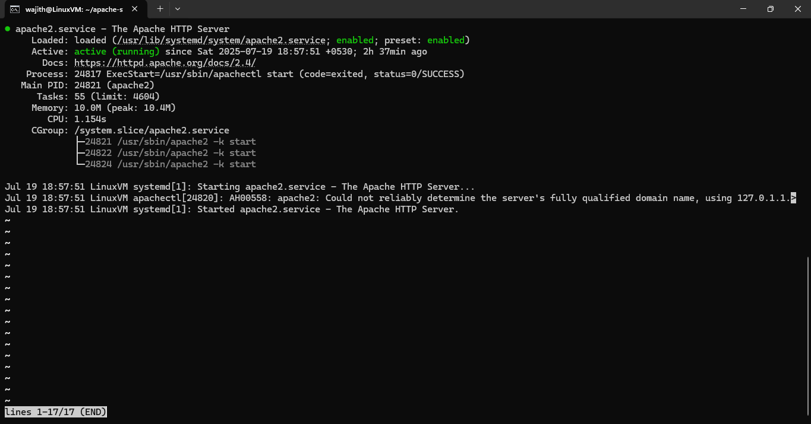
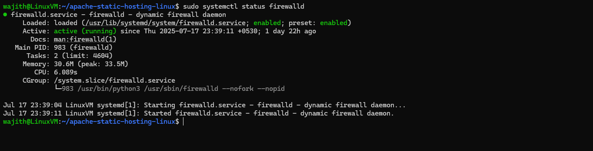
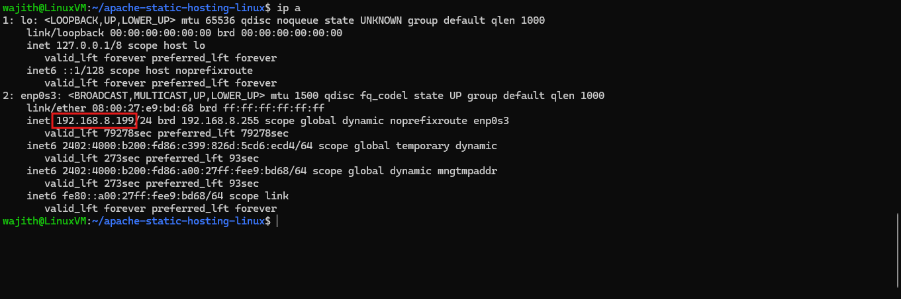
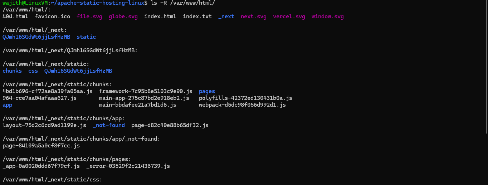

## 📁 Project: Apache Static Hosting (Linux)

This project demonstrates how to deploy a static website using Apache2 on a Linux-based virtual machine. It includes steps to copy exported static site files and configure the Apache web server.

---

## 🔧 Technologies Used

* Oracle Cloud Free Tier (Linux VM)
* Apache2 Web Server
* Static Site (Built with Next.js)

---

## 📂 Repository Structure

```
apache-static-hosting-linux/
├── exported_site/
│   ├── 404.html
│   ├── favicon.ico
│   ├── file.svg
│   ├── globe.svg
│   ├── index.html
│   ├── index.txt
│   ├── next.svg
│   ├── vercel.svg
│   ├── window.svg
│   └── _next/
│       ├── QJmh16SGdWt6jjLsfHzMB/
│       └── static/
│           ├── chunks/
│           ├── css/
│           └── QJmh16SGdWt6jjLsfHzMB/
├── deployment_steps.md
├── apache_config_notes.md
├── README.md
└── screenshots/
    ├── apache_running.png
    ├── browser_view.png
    ├── firewall_enabled.png
    ├── ip_address_checking.png
    └── site_folder_structure.png
```

---

## 📸 Screenshots Overview

| Screenshot                  					    | Description                            |
| ----------------------------------------------------------------- | -------------------------------------- |
|                | Apache2 active and running status      |
|                    | Static site loaded in browser          |
|            | Firewall settings showing Apache ALLOW |
|         | Checking VM IP via `ip a`              |
|  | Folder where static site is deployed   |

---

## 🧾 Documentation Files

| File Name                | Description                             |
| ------------------------ | --------------------------------------- |
| deployment\_steps.md     | Complete step-by-step deployment guide  |
| apache\_config\_notes.md | Optional Apache config (vhost, cleanup) |

---

## 🔗 Accessing Your Site

Visit the deployed site at:

```
http://<VM-IP>
```

Use your Oracle Cloud VM's public IP address.
