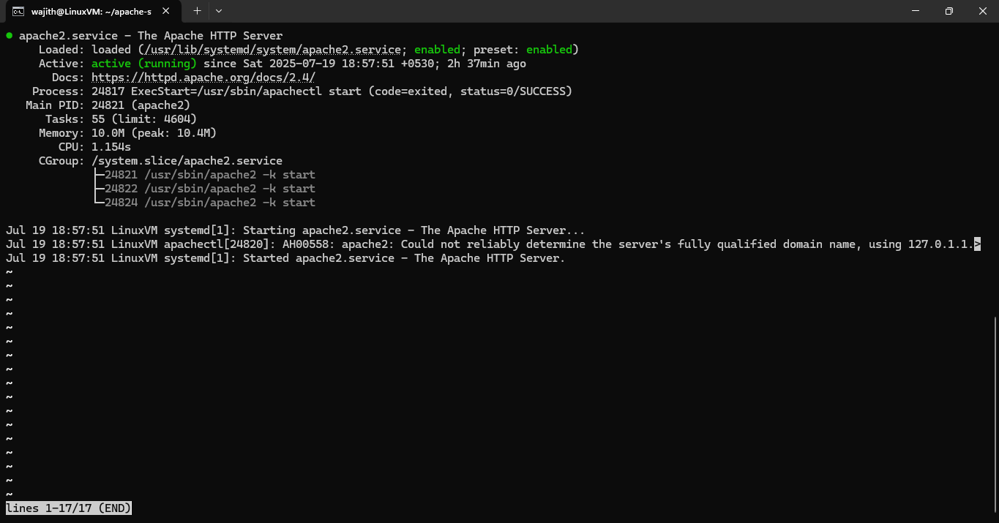
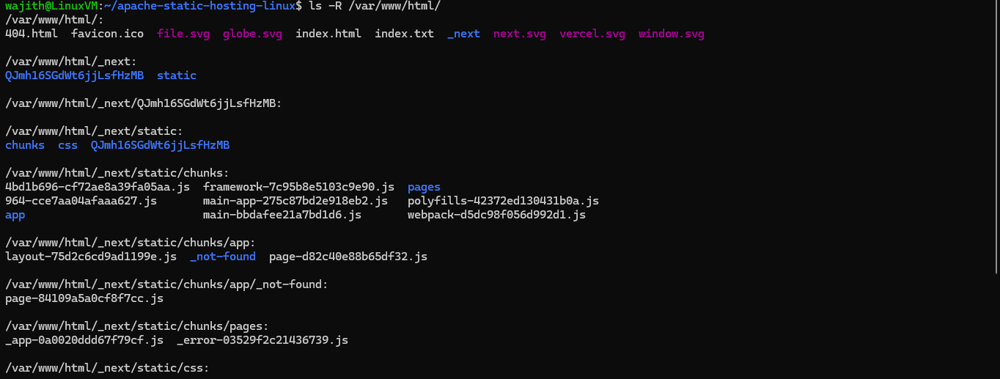
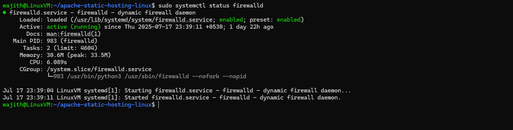
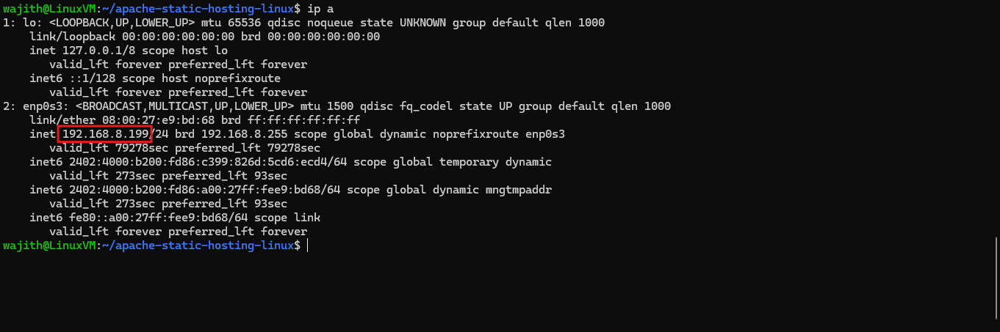
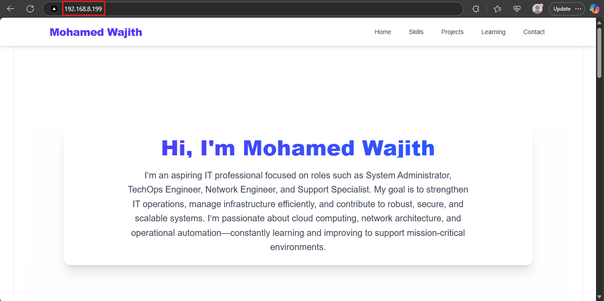

# Deployment Steps for Apache Static Website Hosting on Ubuntu

This document outlines the step-by-step process to deploy a static website using Apache2 on an Ubuntu Linux virtual machine.

---

## Step 1: Install Apache2

```bash
sudo apt update
sudo apt install apache2 -y
```

## Step 2: Start and Enable Apache Service

```bash
sudo systemctl start apache2
sudo systemctl enable apache2
```

## Step 3: Verify Apache Installation

Check if Apache is running:

```bash
sudo systemctl status apache2
```

You should see a status of "active (running)".

Screenshot:


---

## Step 4: Export Static Files from Your Project

Ensure your frontend project is built and exported. For example, if using Next.js:

```bash
npm run build
npm run export
```

Exported files will be inside an `out/` or `exported_site/` folder.

---

## Step 5: Copy Files to Apache Root Directory

```bash
sudo cp -r exported_site/* /var/www/html/
```

You can view the folder structure here:


---

## Step 6: Enable Apache in firewalld

If firewalld is enabled, allow Apache traffic:

```bash
sudo firewall-cmd --permanent --add-service=http
sudo firewall-cmd --reload
sudo firewall-cmd --list-all
```

Screenshot:


---

## Step 7: Find Your VM IP Address

```bash
ip a
```

Look for your IP address (usually under `eth0` or `ens33`).
Screenshot:


---

## Step 8: Access Your Website

Open a browser and navigate to:

```
http://<your-vm-ip>
```

You should see your deployed website.
Screenshot:

